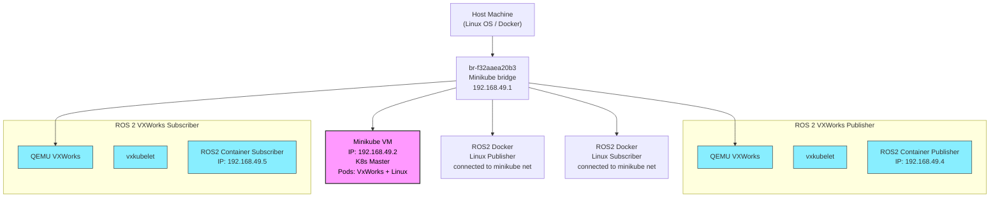

# Real-Time Meets Cloud: ROS 2 on RTOS and Linux with Kubernetes

## Theme: Edge Robotics

## Title: Real-Time Meets Cloud: [ROS 2](https://www.ros.org/) on [VxWorks RTOS](https://www.windriver.com/products/vxworks) and Linux with [Kubernetes](https://www.windriver.com/solutions/learning/what-is-a-kubelet)
## Author: Andrei Kholodnyi, Principal Technologist, Wind River
## Abstract
As robotics systems evolve, the need to integrate real-time capabilities with scalable, cloud-native infrastructure grows significantly. This talk explores how ROS 2 containers can be deployed across both VxWorks RTOS and Linux environments using Kubernetes. We’ll demonstrate a hybrid orchestration approach that leverages a unified container model, showing how OCI-compatible containers can be built for both VxWorks and Linux. This enables seamless management of ROS 2 nodes across heterogeneous platforms. A recorded demo will highlight distributed, containerized robotics applications that span from real-time systems to edge servers, bridging the embedded and cloud-native worlds in modern ROS 2 deployments.

My name is Andrei Kholodnyi, I'm a Principal Technologist at the Office of the CTO, Wind River. I’ve ported [ROS 2 to VxWorks](https://github.com/Wind-River/vxworks7-ros2-build) and a co-chair the [ROS 2 Real-Time Working Group](https://github.com/ros-realtime). At [ROSCon 2025](https://roscon.ros.org/2025/), I’d like to talk about ROS 2, [real-time containers](https://www.windriver.com/containers), and Kubernetes.

## Demo

